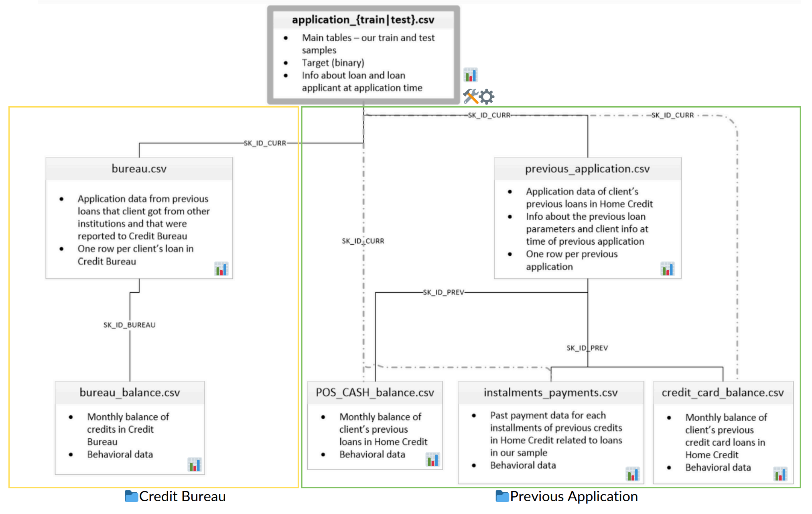

# Loan Repayment Success Prediction
This repository is part of the Final Task Project-Based Internship at Rakamin x Home Credit Indonesia. The goal is to predict loan repayment success, ensuring creditworthy customers are not turned down while maintaining a structure that encourages successful repayments.

## Project Overview
Financial institutions face significant challenges in managing credit risk. This project aims to develop a predictive model to assess loan repayment success based on customer demographics, financial history, and loan details.

Key Objectives:
- Predict loan repayment success accurately.
- Identify key factors influencing repayment behavior.
- Provide actionable business insights for better credit risk management.

## Datasets Description



The project utilizes datasets from Home Credit, including:

- `application_train.csv`: Main dataset for modeling containing customer application data.
- `bureau.csv`: Application data from previous loans that client got form other institutions and that were reorted to Credit Bureau.
- `bureau_balance.csv`: Monthly balance of credits in Credit Bureau.
- `previous_application`.csv: Details of previous customer applications in Home Credit. 
- `POS_CASH_balance.csv`: Monthly balance data of previous loans in Home Credit.
- `installments_payments.csv`: Historical installment payments data in Home Credit.
- `credit_card_balance.csv`: Monthly credit card balance data in Home Credit.

## Methodology

1. **Explanatory Data Analysis (EDA)**
2. **Feature Selection**
3. **Data Preprocessing**: Handling missing values, drop duplicates, outlier treatment, feature transformation, and handle class imbalance.
4. **Machine Learning Modeling**: Implementing machine learning models (Logistic Regression, Decision Tree, and KNN).
5. **Model Evaluations**: Accuracy, precision, recall, and F1-score.

## How to Use this Repository

1. Clone the repository:
   ```bash
   git clone https://github.com/FiZufa/PBI_RakaminxHomeCreditIndonesia_FinalTask.git
   cd PBI_RakaminxHomeCreditIndonesia_FinalTask
2. Install dependencies
    ```bash
    pip install -r requirements.txt
3. Run Jupyter Notebook
